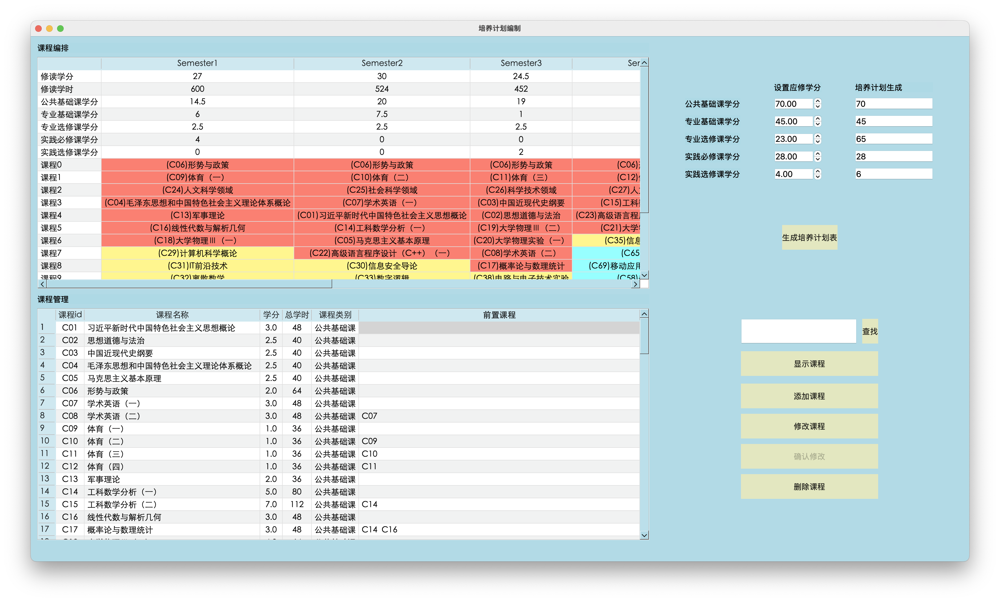
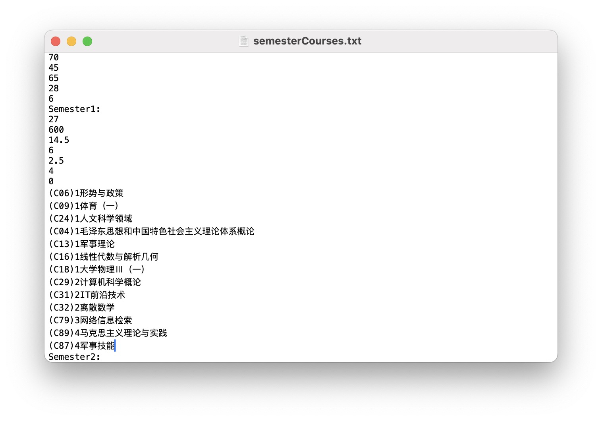

# TrainingPlan
数据结构大作业——培养编制计划

环境：
macOS Sequoia 15.3.2 \
qt 6.8.2

## Table of Content
  
1. [概述](#概述)
    - [题目](#题目)
    - [解决思路](#解决思路)
2. [结果效果展示](#结果效果展示)
3. [核心算法](#核心算法)
    - [核心函数概况](#核心函数概况)
    - [qt函数概况](#qt函数概况)

## 概述

### 题目

>本科培养计划编制是一个复杂的问题，要考虑课程之间的先修关系、实践环节、各学期教学任务的平衡、必修课和选修课学分要求、总学分的要求等等。现要求根据实际情况制定你所在专业的教学计划。要求有以下环节：
>
>F1. 明确专业教学环节，一般包括包括公共基础课、专业必修课、专业选修课、通选课、实践课程、各类实习、毕业设计、军训等。
>
>F2. 明确各教学环节的具体内容，每门课的学分、课时（有些课程还包括实验课时）、课程之间的选修关系。
>
>F3. 明确各个教学环节的学分要求，以及总学分要求。
>
>F4. 设计算法并实施，制订科学可行的培养计划，并用表格方式进行结果展示。

### 解决思路

**1. 明确教学环节**
   1. 找到培养计划中的专业所有课程，明确其类型：公共基础课、专业基础课、专业选修课、实践必修课和实践选修课
   2. 对体育课、通识课、毕业实习和毕业设计环节预分配
**2. 明确各教学的具体内容**
   1. 根据逻辑和经验为课程设置前置课程`prereq`
   2. 分别将公共基础课、专业基础课、专业选修课、实践必修课和实践选修课的类型属性`type`设置为1 2 3 4 5
   3. 将课程信息（id, name, credit, hours, category, prereq）存入一个txt文件，一行一门课
**3. 明确学分要求**
   1. 对于各个教学环节的学分要求，我们让用户自行输入，本项目设置默认值（70， 45， 23， 28， 4）。
   2. 总学分即5类环节需修学分的总和（毕业学分要求）
   3. 最终输出的培养计划中，我们只做推荐，不做强制安排。即，每学期推荐课程总学分可能会相对高，里面的选修课按照自己的兴趣和实际来选，我们只做推荐，所以学会分虚高。
**4. 表格展示**
   1. 程序执行后，会得到8个学期的课程推荐内容，将其按照学期顺序输入结果文件`semesterCourses.txt`
   2. 最终用qt读取文件并解析内容，输出到表格即可

---

## 结果效果展示

结合qt的最终效果展示：

semesterCourses.txt展示：

---

## 核心算法

### 核心函数概况

1. **loadCourses**函数
    - 传入`courses.txt`的文件路径，打开文件并读取课程信息。
    - 按行读取文件，并将课程各属性按顺序存入`Course`的属性中。
    - 其中，前置课程类型为**向量**，同时，输入流读取每一门前置课程，将对应课程的入度 + 1
2. **TopologicalSort**函数
    用**BFS**进行拓扑排序，得到拓扑序列`sortedCourses`
3. **assignCourses**
   1. 对特殊课程预分配
     - 体育课、通选课（前4、5个学期，每个学期一节）
     - 毕业实习、毕业设计（分别安排在第7、8学期）
       
    2. 遍历拓扑序列`sortedCourses`，并按划分到5个向量 **diffTypeCourses** 中，此时，每一个向量中有序，**但拓扑序列被打乱**
       
    3. 给 5 类课程设置学期平均学分`avgCredit`和最高学分`maxCredit`。平均学分使得课程能够均匀分布，最高学分使得学分不会太高 \
       根据经验设置 avgCredit 和 maxCredit，如：
       - 公共基础课集中在前 3 个学期
       - 专业选修课集中在 4-7 学期
       - 实践选修课集中在5-6学期
         
    4. 每次分配课程需要对课程前置课程的安排情况进行检查
       
    5. 安排成功的课程记录在二维向量`vector<vector<string>> semesters(8)` 中，每个学期的课程安排为一个向量
       
    6. 将结果写入文件`semesterCourses.txt`，同样输入的有每学期各类课程的总学分以及8学期的总学分

### qt部分函数

1. **loadtxtIntoTable**
   在运行项目时，调用该函数，直接显示`courses.txt`到ui表格中。
   实现很简单，按行读取即可，和`loadCourses`函数相仿
2. **appendOneRow**
   每读取一行，将各属性传入该函数，该函数将在表格最后添加一行，并设置单元格内容
3. **getTrainingPlan**
   按顺序调用三个核心函数，并将从ui上获取的4类课程应修学分，将其传入`assignCourses`函数即可。
   另外，调用下一个函数，将`semesterCourses.txt`内容导在表格上即可
4. **loadResultTxtIntoTable**
   将结果文件导入在ui上的结果表格
   - 要求前面 7 行为固定的行，即每学期的总学分、总学时和 5 类课程总学分
   - 后面的课程按照最多的那一学期的课程数来排，动态增加行数
   - 解析每学期的课程（格式：(ID)type Cname），并根据 type 设置不同的单元格颜色（1红 2黄 3蓝 4绿 5白）
   - 最后再输出 8 学期的 5 类课程总学分
5. **on_searchCourse_clicked**
   获取ui传来的关键词，遍历表格匹配关键词，最后定位单元格并对单元格高亮显示
6. **on_editCourse_clicked**
   “修改课程”被点击时，“确认修改”按钮才开启。同时不可更改的表格变为除了id都能更改的表格
7. **on_confirmButton_clicked**
   “确认修改”被点击后，遍历表格所有行，并将单元格信息一一存储到`vector<Course> updatedCourses`
   将`updatedCourses`作为参数调用`updateCourseInFile`，使得可进行课程信息文件的修改
8. **updateCourseInFile**
   打开结果文件`semesterCourses.txt`并清空其数据，并将新数据写进去
9. **on_deleteCourse_clicked()**
    选中一行后才能进行删除。删除ui上的记录，并更新`courseIDs`（移除被删除的id），并传入这个id调用函数`updateCourseFile`
10. **updateCourseFile**
    **删除后对.txt文件进行更新**。按行读取文件内容，匹配id，未匹配成功的写入`courses.txt`，反之，不写入（相当于删除）
